# ⚙️ RTL-to-GDSII Flow using OpenROAD and Sky130


> A complete **RTL-to-GDSII ASIC Physical Design Flow** implemented using the **OpenROAD Toolchain** and **SkyWater 130nm (Sky130) PDK** as part of the **"VLSI Design Using Open Source Tools"** workshop organized by **Girijananda Chowdhury University** in association with **NiNE Labs, IIT Guwahati**.

---

# 🖼️ Final GDSII Layout

<p align="center">
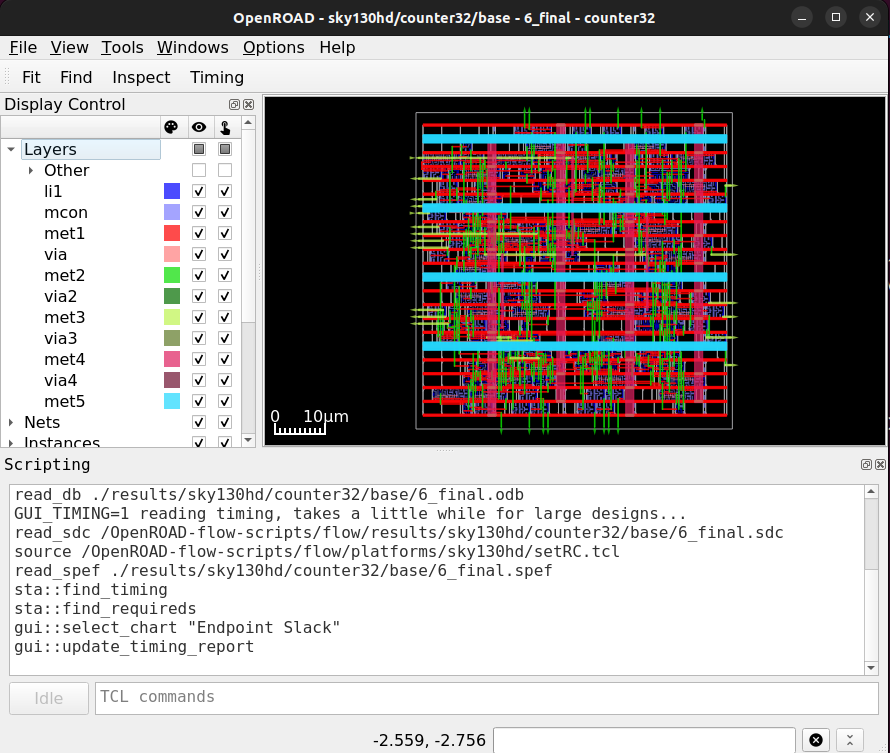
</p>

---

# 📖 Project Overview

This project demonstrates the complete RTL-to-GDSII ASIC implementation flow using modern open-source Electronic Design Automation (EDA) tools.

The target design is a **32-bit synchronous up-counter**, which was implemented from RTL description to manufacturable GDSII layout using the OpenROAD physical design flow and Sky130 Process Design Kit (PDK).

The project covers every major stage of ASIC implementation, including:

- RTL Design
- Design Configuration
- Timing Constraints
- Floorplanning
- Placement
- Clock Tree Synthesis (CTS)
- Routing
- Static Timing Analysis (STA)
- Power Analysis
- GDSII Generation

---

# 🎯 Objectives

- Learn the complete RTL-to-GDSII ASIC design flow.
- Perform physical implementation using OpenROAD.
- Use SkyWater130 open-source PDK.
- Generate timing, area and power reports.
- Perform routing using multi-metal layers.
- Generate the final GDSII layout.

---

# 🛠️ Tools & Technologies

- OpenROAD
- SkyWater130 (Sky130) PDK
- Verilog HDL
- Ubuntu Linux
- OpenSTA
- TCL
- ASIC Physical Design Flow

---

# 🔄 RTL-to-GDSII Design Flow

```text
RTL Design (Verilog)
        │
        ▼
Configuration (config.mk)
        │
        ▼
Timing Constraints (constraint.sdc)
        │
        ▼
Logic Synthesis
        │
        ▼
Floorplanning
        │
        ▼
Placement
        │
        ▼
Clock Tree Synthesis (CTS)
        │
        ▼
Global Routing
        │
        ▼
Detailed Routing
        │
        ▼
Static Timing Analysis
        │
        ▼
Power Analysis
        │
        ▼
GDSII Layout Generation
```

---

# 💻 RTL Design

The target design selected for implementation was a **32-bit synchronous up-counter**.

### RTL Code

<p align="center">
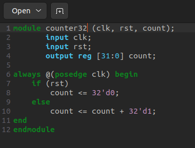
</p>

---

# ⚙️ Configuration File

The configuration file defines:

- Design Name
- Sky130 Platform
- RTL Path
- Core Utilization
- Placement Density

<p align="center">
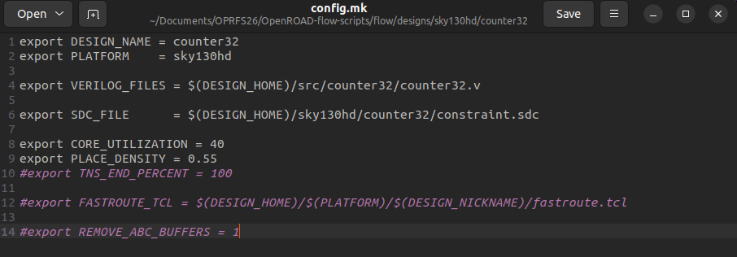
</p>

---

# ⏱️ Timing Constraints

Timing constraints were defined using **constraint.sdc**.

Configuration includes:

- Clock Period = **10 ns**
- Input Delay
- Output Delay

<p align="center">
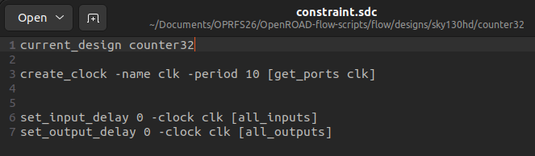
</p>

---

# 🚀 OpenROAD Flow Execution

The OpenROAD flow was executed through the following stages:

1. RTL Reading
2. Timing Constraint Application
3. Logic Synthesis
4. Floorplanning
5. Placement
6. Clock Tree Synthesis
7. Global Routing
8. Detailed Routing
9. GDSII Generation

### OpenROAD Execution

<p align="center">
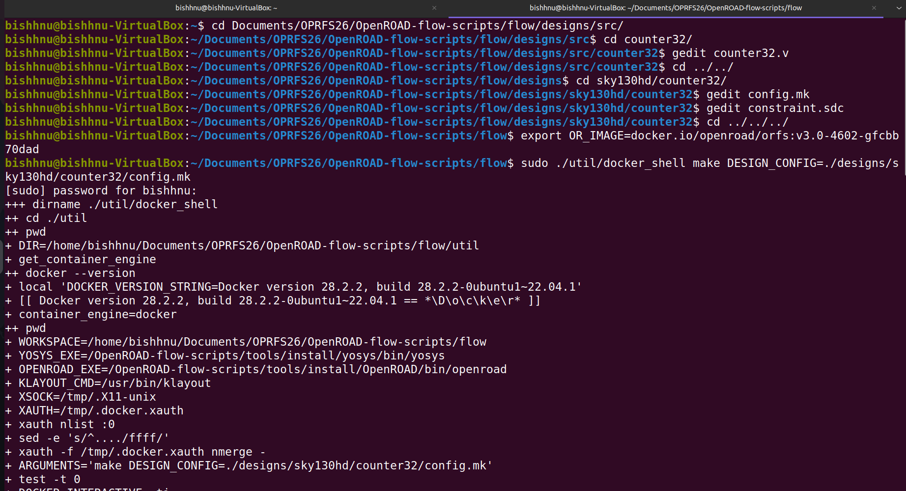
</p>

<p align="center">
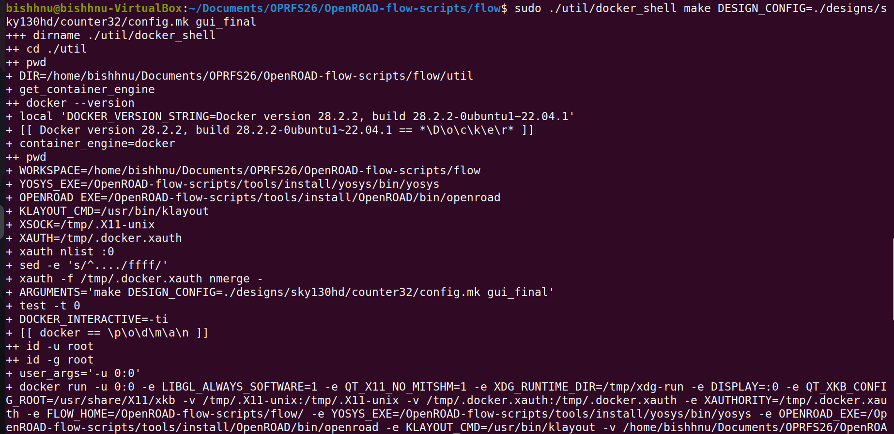
</p>

<p align="center">
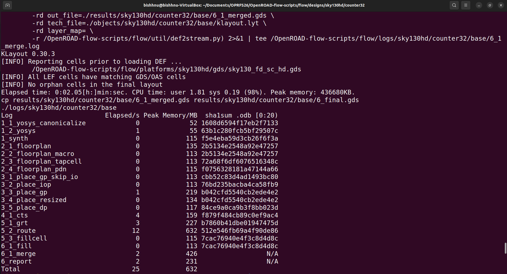
</p>

<p align="center">
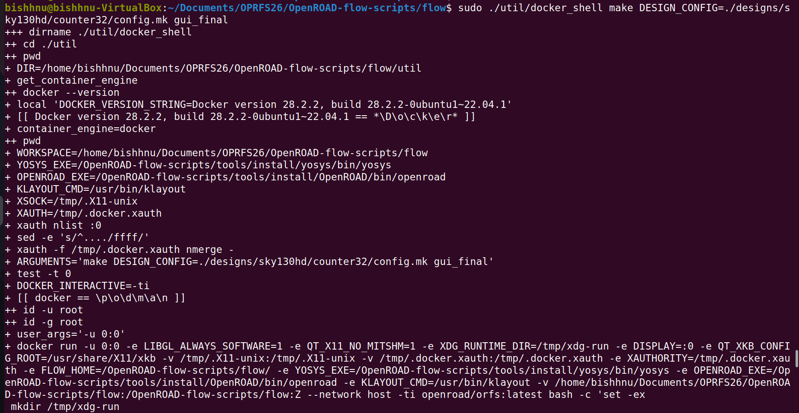
</p>

---

# 📊 Timing Analysis

## Setup Slack

<p align="center">
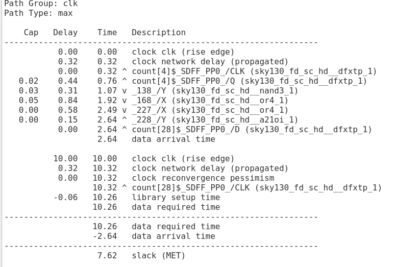
</p>

---

## Timing Report (Setup Slack, TNS & WNS)

<p align="center">
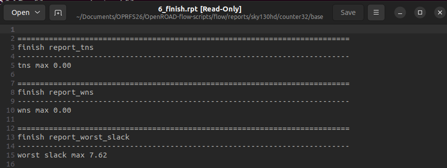
</p>

---

# 📏 Area Report

The implementation successfully generated the physical layout along with design area and core utilization information.

<p align="center">
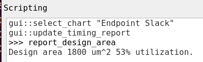
</p>

---

# ⏳ Path Delay Analysis

## Maximum Path Delay

<p align="center">
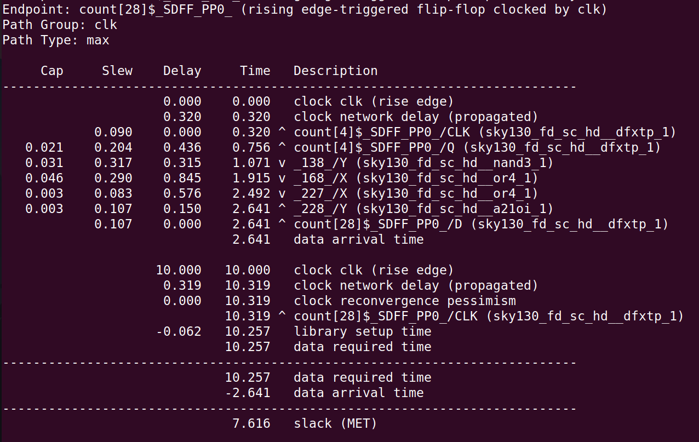
</p>

---

## Minimum Path Delay

<p align="center">
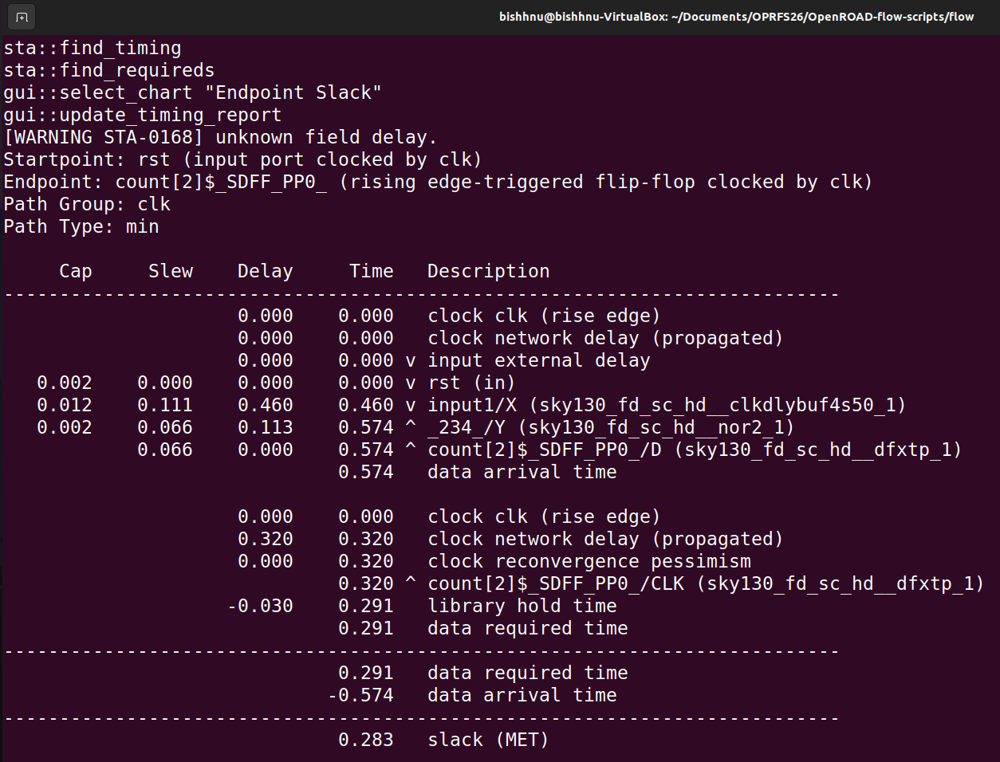
</p>

---

# ⚡ Capacitance Analysis

The design was analyzed for maximum capacitance during timing verification.

<p align="center">
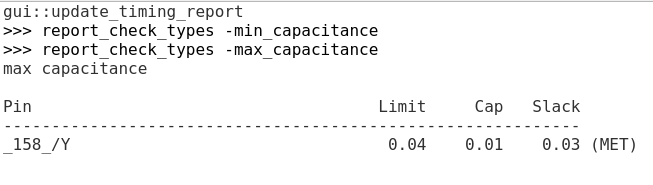
</p>

---

# 🔋 Power Analysis

Power consumption and clock period information generated by OpenROAD.

<p align="center">
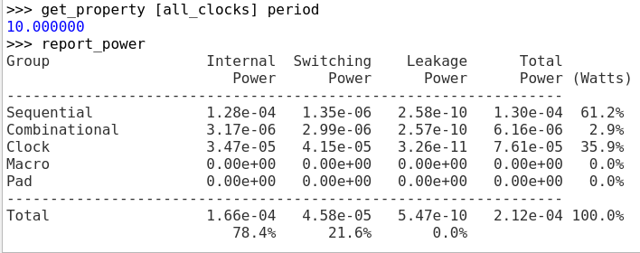
</p>

---

# 🧩 Final GDSII Layout

Generated GDSII layout after complete RTL-to-GDSII implementation.

<p align="center">
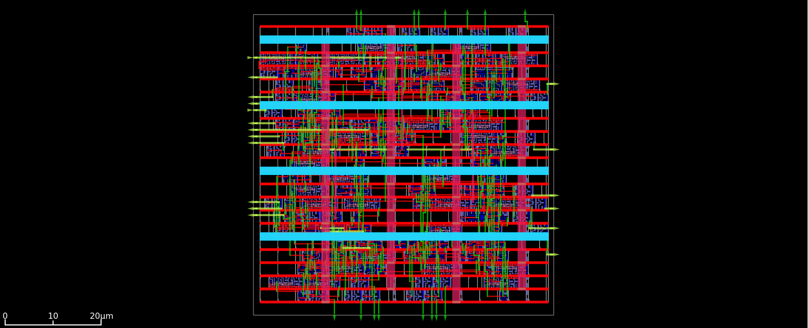
</p>

---

# 📂 Repository Structure

```text
RTL-to-GDSII-Flow-using-OpenROAD-and-Sky130
│
├── Images
│   ├── rtl_design.png
│   ├── config_mk.png
│   ├── constraint_sdc.png
│   ├── execution1.png
│   ├── execution2.png
│   ├── execution3.png
│   ├── execution4.png
│   ├── setup_slack.png
│   ├── timing_report.png
│   ├── area_report.png
│   ├── max_path_delay.png
│   ├── min_path_delay.png
│   ├── capacitance_report.png
│   ├── power_report.png
│   ├── gds_layout.png
│   └── final_layout.png
│
├── Report
│   └── workshop_project_report.pdf
│
├── README.md
├── LICENSE
└── .gitignore
```

---

# 📚 Skills Gained

- RTL Design using Verilog HDL
- ASIC Physical Design Flow
- OpenROAD Toolchain
- Sky130 Process Design Kit
- Static Timing Analysis (STA)
- Floorplanning
- Placement
- Clock Tree Synthesis
- Routing
- Power Analysis
- GDSII Layout Generation
- Linux-based EDA Workflow

---

# 🔮 Future Improvements

- Implement larger digital designs (ALU, RISC-V Core, FIFO, etc.)
- Perform Design Rule Check (DRC)
- Perform Layout Versus Schematic (LVS)
- Explore timing optimization techniques
- Compare different standard-cell libraries
- Implement low-power ASIC design techniques

---

# 🙏 Acknowledgements

This project was completed as part of the workshop:

**"VLSI Design Using Open Source Tools"**

Organized by:

- Girijananda Chowdhury University
- NiNE Labs, IIT Guwahati

Sponsored by:

- Ministry of Electronics & Information Technology (MeitY), Government of India

---

# 👨‍💻 Author

**Bishnujyoti Gogoi**

B.Tech – Electronics & Telecommunication Engineering

Jorhat Institute of Science & Technology

📧 Email: **bishnujyotigogoi01@gmail.com**

🔗 GitHub: https://github.com/bishnujyoti-gogoi

💼 LinkedIn: https://www.linkedin.com/in/bishnujyoti-gogoi-24b908247/

---

# 📄 Workshop Report

The complete workshop report is available in the **Report** folder.

---

# 📜 License

This project is licensed under the **MIT License**.

⭐ If you found this project useful, consider starring the repository.
